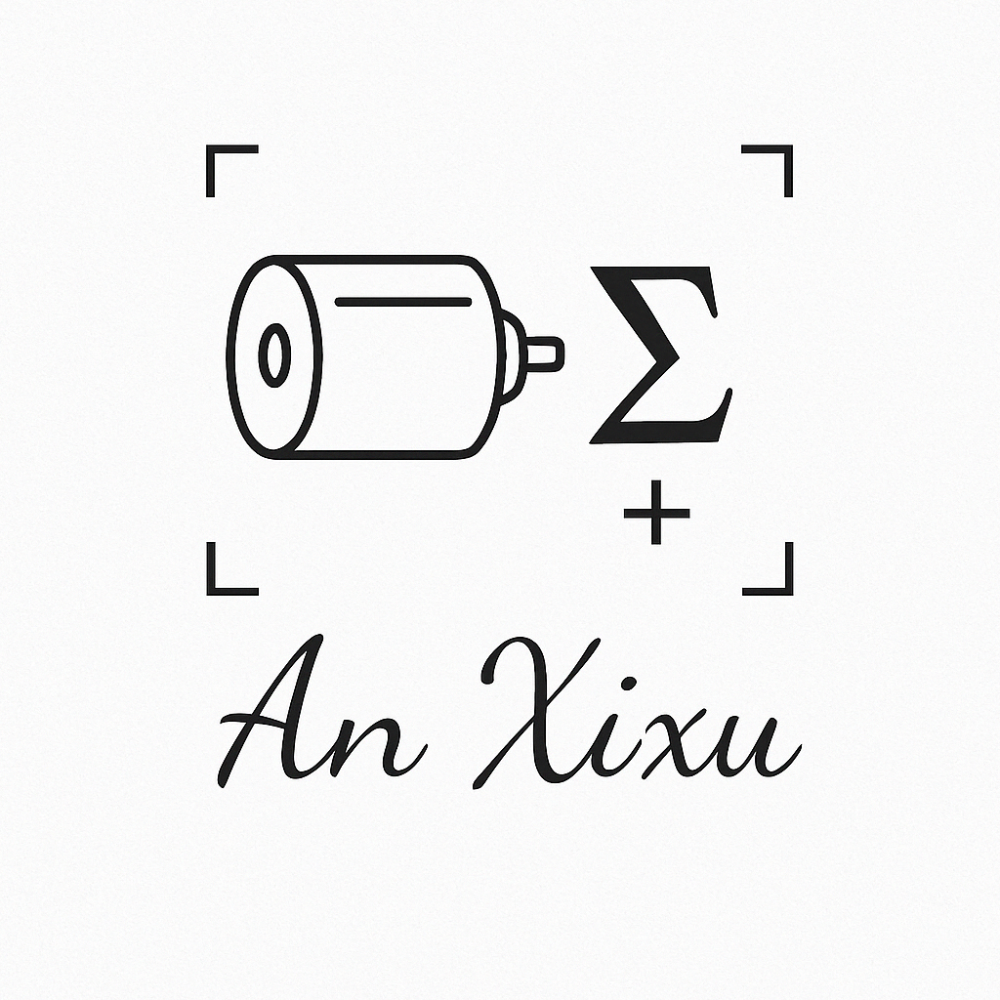
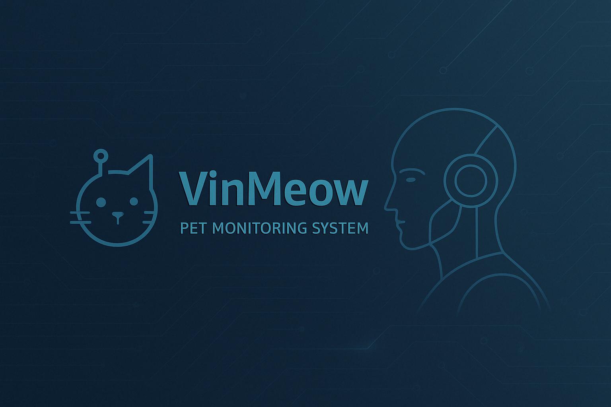
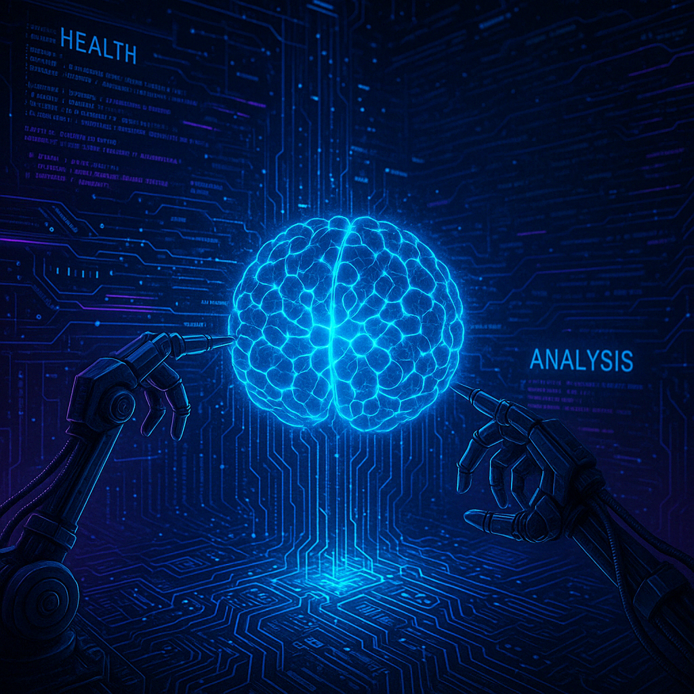

<!-- GitHub Profile README with banner -->

<p align="center">
  
</p>

<p align="center">
  
  
  
  
</p>


<h1 align="center">Hi, I'm 安希旭 | An XiXu 🌐</h1>
<p align="center">🤖 Robotics Algorithm Engineer · 去中心化理想主义者 · AI for Freedom</p>

---

## 🧬 About Me | 关于我

- 🔧 专注机器人算法：感知｜控制｜嵌入式推理
- 💡 理想主义技术派：拥抱 **自由、平等、去中心化**
- 🐱 项目：**VinMeow**，猫咪情绪与健康AI监测设备
- 🧠 机器人之于我，是与生命和意识边界的对话

---


## 🔭 Projects | 项目中

<div align="center">

🎯 **VinMeow**  
🧠 猫咪情绪AI监测 · 本地轻量部署 · 守护猫主子生命安全  



---

⚙️ **X3 EdgeAI**  
板载大模型部署 · 地平线X3 · 超低功耗的智慧之眼  



---

🌐 **自由系统**  
去中心化协议 + AI接口  
为自由而设计的机器人感知与决策系统


</div>

---

## 🌱 Philosophy | 信仰

```
人人生而自由，人人生而平等  
永远不要放弃  
We are not cogs. We are creators.
Decentralization is humanity’s heartbeat in the age of code.
```

---

## 📫 Connect with Me

- 📬 Email: `virtual0429@gmail.com`
- 🌟 Star a project, say hi ~

---

## 🎨 Code + Soul

<div align="center">

```
      🌍           🤖
  Free minds + Free code
     ⛓️ ➡️ ⚙️ ➡️ 🌱
      Rewire the world
```

</div>

<p align="center">
  <em>“Coding is how I resist entropy.”</em>
</p>

